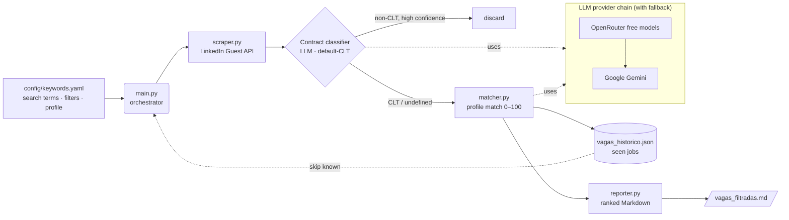

# JobMatch AI 🎯

> Automated pipeline that **scrapes LinkedIn job postings**, **filters them by contract type (CLT)** and **scores how well each one matches your professional profile** using a resilient chain of LLMs (OpenRouter → Gemini). The result is a clean, ranked Markdown report so you only spend time applying to the jobs worth applying to.

<p align="left">
  
  
  
  
</p>

---

## ✨ Why this project

Searching for a job on LinkedIn is noisy: hundreds of postings, many of them the wrong
contract type, the wrong location, or a poor fit for your background. This tool turns that
manual triage into a repeatable pipeline:

- **No re-work** — every job already seen is stored in a history file and skipped on the next run.
- **Contract-aware** — an LLM infers whether each posting is *CLT* (the target) or *PJ / freelancer / internship / temporary*, with a **default-CLT** policy so good jobs are never discarded by accident.
- **Honest matching** — each job is scored 0–100 against your profile, with concrete strengths, gaps and a verdict — not just a number.
- **Resilient by design** — a provider chain (OpenRouter free models first, Gemini as fallback) with retries means a single rate-limit (`429`) doesn't kill the run.

## 📸 Demo

> _Add a terminal GIF of a run here, plus a screenshot of the rendered `vagas_filtradas.md`._
>
> A sample of the generated report lives in [`examples/vagas_filtradas.sample.md`](examples/vagas_filtradas.sample.md).

## 🧩 Architecture



**Pipeline stages**

1. **Collect** — `scraper.py` queries LinkedIn's public Guest API per search term and filter, rotating User-Agents and retrying on `429`. Jobs already in the history are skipped *before* the description is downloaded, and location/work-model filtering happens on the card to save requests.
2. **Classify contract** — for each new job, an LLM decides the employment type. Brazil's market defaults to CLT, so a job is **only discarded** when there is *explicit* evidence of a non-CLT regime above a confidence threshold (`MIN_DISCARD_CONFIDENCE = 0.6`).
3. **Deduplicate** — near-duplicate reposts (same title + company, different IDs/cities) are collapsed to avoid wasting LLM calls.
4. **Match** — `matcher.py` sends the job description + your profile to the LLM and gets back a structured `{ match_score, strengths, gaps, verdict }`.
5. **Report & remember** — `reporter.py` writes a ranked Markdown table + detail sections; `vagas_historico.json` is updated with metadata and timestamps.

## 🛠️ Tech stack

| Area | Tools |
| --- | --- |
| Language | Python 3.10+ |
| Scraping | `requests`, `beautifulsoup4` |
| LLMs | OpenRouter (OpenAI-compatible API, free models) → Google Gemini (`google-genai`) |
| Config | YAML (`pyyaml`), `.env` via `python-dotenv` |
| Output | Markdown report + JSON history |

> **Design note:** v1 used a local **embeddings** model (`sentence-transformers`) to classify contract type by cosine similarity. It was dropped because the contract signal (1–2 sentences) was diluted across the full job description, leaving ~90% of jobs "ambiguous". The LLM classifier reads the description *as a human would* and applies the default-CLT rule, which is both more accurate and removes a heavy (~1 GB / PyTorch) dependency.

## 🚀 Getting started

### 1. Clone and install

```bash
git clone https://github.com/Delkyros/CV_bot.git
cd CV_bot
python -m venv .venv
# Windows
.venv\Scripts\activate
# macOS / Linux
source .venv/bin/activate
pip install -r requirements.txt
```

### 2. Configure your keys

```bash
cp .env.example .env
```

Edit `.env` and set at least one provider key (`OPENROUTER_API_KEY` is the primary, `GEMINI_API_KEY` the fallback).

### 3. Configure your search & profile

```bash
cp config/keywords.example.yaml config/keywords.yaml
```

Edit `config/keywords.yaml` with your target roles, location filters and your professional profile. `config/keywords.yaml` is git-ignored, so your personal data never gets committed.

### 4. Run

```bash
python main.py
```

The ranked report is written to `vagas_filtradas.md` at the project root, and `vagas_historico.json` is updated so the next run skips everything already seen.

## ⚙️ Configuration reference (`config/keywords.yaml`)

| Key | Description |
| --- | --- |
| `termos_busca` | List of job titles to search (don't append "CLT" — it's inferred). |
| `tipo_contratacao` | Target contract type. `"CLT"` enables the LLM contract filter. |
| `max_vagas_por_termo` | Max jobs collected per (term × filter) combination. |
| `tempo_publicacao` | Posting age filter: `"24h"`, `"semana"`, `"mes"`, or empty. |
| `filtros_busca` | Accepted work-model/location scenarios (uses LinkedIn `geo_id`). |
| `perfil_candidato` | Your summary, hard skills, soft skills and seniority. |

## 🔧 Tunables (`.env`)

Everything operational is configurable via environment variables — nothing is hardcoded. Each has a sensible default, so the pipeline runs out of the box; set any of these in `.env` only to override. See `.env.example` for the full list with defaults.

| Variable | Default | Description |
| --- | --- | --- |
| `REPORT_MIN_CLT_SCORE` | `0.6` | Min CLT confidence (`score_clt`) for a job to appear in the report. `N/A` is always hidden. |
| `REPORT_MIN_MATCH_SCORE` | `50` | Min profile match (`match_score`, 0–100) for a job to appear. |
| `CONTRACT_DISCARD_CONFIDENCE` | `0.6` | Min confidence to discard a job as non-CLT during collection. |
| `OPENROUTER_MODEL` / `OPENROUTER_MODELS` | built-in list | Pin one model, or override the whole comma-separated list. |
| `GEMINI_MODEL` | `gemini-2.5-flash` | Gemini fallback model. |
| `LLM_TEMPERATURE` / `OPENROUTER_MAX_TOKENS` / `LLM_REQUEST_TIMEOUT` | `0.1` / `2000` / `60` | LLM sampling, output budget, HTTP timeout. |
| `LLM_MAX_PROVIDER_CYCLES` / `LLM_QUOTA_RETRY_WAIT` | `3` / `60` | Provider-chain retry cycles and wait between them. |
| `SCRAPER_MAX_RETRIES` / `SCRAPER_RETRY_WAIT` / `SCRAPER_REQUEST_TIMEOUT` / `SCRAPER_MAX_PAGES` | `5` / `5` / `15` / `10` | Scraper retry, timeout and pagination limits. |
| `SCRAPER_MIN_REQUEST_DELAY` / `SCRAPER_MAX_REQUEST_DELAY` | `1.0` / `3.0` | Random pause range (s) between requests. |
| `KEYWORDS_CONFIG_PATH` / `HISTORY_PATH` / `REPORT_OUTPUT_PATH` | `config/keywords.yaml` / `vagas_historico.json` / `vagas_filtradas.md` | File locations. |

## 📂 Project structure

```text
CV_bot/
├── config/
│   └── keywords.example.yaml   # Template config (copy to keywords.yaml)
├── src/
│   ├── scraper.py              # LinkedIn Guest API collection + filtering
│   ├── matcher.py              # LLM provider chain: match + contract classifier
│   ├── text_signals.py         # Text normalization + non-CLT keyword signals
│   ├── reporter.py             # Markdown report generation
│   ├── settings.py             # Env-backed tunables (.env) with defaults
│   └── logging_config.py       # Centralized logging setup
├── docs/specs.md               # Original technical spec (pt-BR)
├── examples/                   # Sample output
├── main.py                     # End-to-end orchestrator
├── requirements.txt
├── .env.example
└── LICENSE
```

## 🗺️ Roadmap

- [ ] Token usage tracking per run/job (in/out tokens; cost only when a paid model is set, else "free tier")
- [ ] Free-model benchmark: run all free models over an eval set and rank them by
      accuracy (vs expected verdicts), tokens, latency and parse reliability — to
      pick the best free model for our objective
- [ ] (later) Async matching across jobs with a concurrency limit, once the primary model is chosen

## ⚠️ Legal & ethical notice

This project is for **educational and personal use**. It accesses LinkedIn's public Guest
endpoints, which may be against [LinkedIn's Terms of Service](https://www.linkedin.com/legal/user-agreement).
Use it responsibly, at your own risk, with low request volumes. The author is not responsible
for any misuse or account restrictions.

## 📄 License

[MIT](LICENSE) © Gustavo Fortunato
