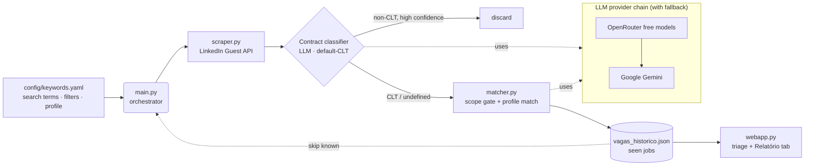

# JobMatch AI 🎯

> Automated pipeline that **scrapes LinkedIn job postings**, **filters them by contract type (CLT)** and **scores how well each one matches your professional profile** using a resilient chain of LLMs (OpenRouter → Gemini). The result is a clean, ranked Markdown report so you only spend time applying to the jobs worth applying to.

<p align="left">
  
  
  
  
</p>

---

## ✨ Why this project

Searching for a job on LinkedIn is noisy: hundreds of postings, many of them the wrong
contract type, the wrong location, or a poor fit for your background. This tool turns that
manual triage into a repeatable pipeline:

- **No re-work** — every job already seen is stored in a history file and skipped on the next run.
- **Contract-aware** — an LLM infers whether each posting is *CLT* (the target) or *PJ / freelancer / internship / temporary*, with a **default-CLT** policy so good jobs are never discarded by accident.
- **Honest matching** — each job is scored 0–100 against your profile, with concrete strengths, gaps and a verdict — not just a number.
- **Resilient by design** — a provider chain (OpenRouter free models first, Gemini as fallback) with retries means a single rate-limit (`429`) doesn't kill the run.

## 🧩 Architecture


```mermaid
flowchart LR
    A[config/keywords.yaml<br/>search terms · filters · profile] --> B(main.py<br/>orchestrator)
    H[(vagas_historico.json<br/>seen jobs)] -. skip known .-> B
    B --> C[scraper.py<br/>LinkedIn Guest API]
    C --> D{Contract classifier<br/>LLM · default-CLT}
    D -- non-CLT, high confidence --> X[discard]
    D -- CLT / undefined --> E[matcher.py<br/>scope gate + profile match]
    E --> H
    H --> W[webapp.py<br/>triage + Relatório tab]

    subgraph LLM["LLM provider chain (with fallback)"]
        P1[OpenRouter free models] --> P2[Google Gemini]
    end
    D -.uses.-> LLM
    E -.uses.-> LLM
```

**Pipeline stages**

1. **Collect** — `scraper.py` queries LinkedIn's public Guest API per search term and filter, rotating User-Agents and retrying on `429`. Jobs already in the history are skipped *before* the description is downloaded, and location/work-model filtering happens on the card to save requests.
2. **Classify contract** — for each new job, an LLM decides the employment type. Brazil's market defaults to CLT, so a job is **only discarded** when there is *explicit* evidence of a non-CLT regime above a confidence threshold (`MIN_DISCARD_CONFIDENCE = 0.6`).
3. **Deduplicate** — near-duplicate reposts (same title + company, different IDs/cities) are collapsed to avoid wasting LLM calls.
4. **Match & scope-filter** — an embedding scope gate drops a job only when BOTH its title (vs your search terms) and description (vs your CV) are far off; survivors get a structured `{ match_score, strengths, gaps, verdict }` from Gemini. Each kept job stores three comparable scores: `score_gemini`, `score_vetor_desc`, `score_title`.
5. **Remember** — `vagas_historico.json` is updated with the scores, analysis prose, metadata and timestamps. The web app's **Relatório** tab renders it (the old Markdown report was removed).

## 🛠️ Tech stack

| Area | Tools |
| --- | --- |
| Language | Python 3.10+ |
| Scraping | `requests`, `beautifulsoup4` |
| LLMs | OpenRouter (OpenAI-compatible API, free models) → Google Gemini (`google-genai`) |
| Config | YAML (`pyyaml`), `.env` via `python-dotenv` |
| Output | JSON history + web app (triage + Relatório tab) |

> **Design note:** v1 used a local **embeddings** model (`sentence-transformers`) to classify contract type by cosine similarity. It was dropped because the contract signal (1–2 sentences) was diluted across the full job description, leaving ~90% of jobs "ambiguous". The LLM classifier reads the description *as a human would* and applies the default-CLT rule, which is both more accurate and removes a heavy (~1 GB / PyTorch) dependency.

## 🚀 Getting started

### 1. Clone and install

```bash
git clone https://github.com/Delkyros/CV_bot.git
cd CV_bot
py -0
# Installed Pythons found by C:\WINDOWS\py.exe Launcher for Windows
# -3.9-64
# -3.10-64
# Select your correct version of python for this repo
py -3.10 -m venv .venv
# Windows
.venv\Scripts\activate
# macOS / Linux
source .venv/bin/activate
pip install -r requirements.txt
```

### 2. Configure your keys

```bash
cp .env.example .env
```

Edit `.env` and set `GEMINI_API_KEY` (the only LLM provider; without it the pipeline still runs, scoring locally by embeddings).

### 3. Configure your search & profile

```bash
cp config/keywords.example.yaml config/keywords.yaml
```

Edit `config/keywords.yaml` with your target roles, location filters and your professional profile. `config/keywords.yaml` is git-ignored, so your personal data never gets committed.

### 4. Run

```bash
python main.py
```

Results are persisted to `vagas_historico.json` (browse them in the web UI, including the Relatório tab), and the next run skips everything already seen.

## 🐳 Run with Docker (recommended)

No local Python or virtualenv needed — just Docker. The image is a hardened, multi-stage Python 3.10 build that runs as a non-root user on a read-only root filesystem. A single `web` dashboard service serves the UI, runs the pipeline on a recurring schedule (**every 6 hours** by default) and on demand from the **"Rodar agora"** button.

```bash
# 1. Provide your search & profile (same as the native flow)
cp config/keywords.example.yaml config/keywords.yaml   # then edit it

# 2. Create your compose file and add your API key(s)
cp docker-compose.example.yml docker-compose.yml        # then edit the environment: block

# 3. Build and start the dashboard (schedules runs + serves the UI at :8000)
docker compose build
docker compose up -d

# Follow the output / stop it
docker compose logs -f
docker compose down
```

- **Scheduling** is handled by the in-app scheduler in the dashboard (`webapp.py`) via `RUN_INTERVAL_SECONDS` (default `21600` = 6h) and `RUN_ON_START` (default `true`). No host cron / Task Scheduler needed, and it survives reboots (`restart: unless-stopped`). A failed run never breaks the schedule.
- For **manual-only** (no automatic runs — trigger from the dashboard button), set `SCHEDULER_ENABLED: "false"` (or `RUN_INTERVAL_SECONDS: "0"`).
- API keys and all tunables live in the `environment:` block of `docker-compose.yml` (git-ignored). `docker-compose.example.yml` is the versioned template.
- `config/keywords.yaml` is mounted read-only; the history is written to `./data/` on the host (`data/vagas_historico.json`) and persists across runs so already-seen jobs are skipped.
- Hardening: `read_only` root fs, `cap_drop: ALL`, `no-new-privileges`, non-root user, and no build tools in the runtime image.

## ✅ Mark jobs as viewed / applied (web UI)

A small web UI (`webapp.py`) reads the persistent `vagas_historico.json` and lets you mark each job **Novo / Visto / Inscrito**, add notes, and compare the three scores per job in the **Relatório** tab. Marks are written straight back into the history JSON, so they **survive every new search run**.

With Docker (the `web` service in the compose file is already wired up):

```bash
docker compose up -d            # starts the dashboard (schedules runs + serves the UI)
# open http://localhost:8000
```

Or natively:

```bash
python webapp.py                # open http://localhost:8000
```

- Status + notes live in `vagas_historico.json` (same `./data` volume the scraper uses) — the web UI and the pipeline share one source of truth.
- The scraper re-reads the history at save time and preserves your `status`/`notes`, so a run that happens while you're triaging never clobbers your marks.
- Filters in the UI: search, *Só relevantes* (same threshold as the report), *Só novas*, *Ocultar inscritas*.

### Run the pipeline from the dashboard

The dashboard also **controls** the pipeline, not just the results. A single **"Rodar agora"** button:

- **Triggers a run** in the background (spawns the pipeline as a subprocess, so a crash never takes the web app down).
- **Guards concurrency** — while a run is in progress the button is disabled; a second trigger is rejected with "já em execução" (never two runs at once).
- **Shows live progress** — a bar advances through the stages (scraping → matching → reporting) while it runs.
- **Runs automatically** on a recurring interval, with a **countdown on the button** to the next automatic run. Triggering a manual run resets the countdown.

The web app owns scheduling (see the Docker note below), and run/progress state lives in `run_state.json` — a small file **separate** from `vagas_historico.json`, safe to delete.

> **Docker:** a single `web` service owns scheduling and runs the pipeline — there's no separate scraper container, so runs never overlap. See `docker-compose.example.yml`.

## ⚙️ Configuration reference (`config/keywords.yaml`)

| Key | Description |
| --- | --- |
| `termos_busca` | List of job titles to search (don't append "CLT" — it's inferred). |
| `tipo_contratacao` | Target contract type. `"CLT"` enables the LLM contract filter. |
| `max_vagas_por_termo` | Max jobs collected per (term × filter) combination. |
| `tempo_publicacao` | Posting age filter: `"24h"`, `"semana"`, `"mes"`, or empty. |
| `filtros_busca` | Accepted work-model/location scenarios (uses LinkedIn `geo_id`). |
| `perfil_candidato` | Your summary, hard skills, soft skills and seniority. |

## 🔧 Tunables (`.env`)

Everything operational is configurable via environment variables — nothing is hardcoded. Each has a sensible default, so the pipeline runs out of the box; set any of these in `.env` only to override. See `.env.example` for the full list with defaults.

| Variable | Default | Description |
| --- | --- | --- |
| `REPORT_MIN_CLT_SCORE` | `0.7` | Min CLT confidence (`score_clt`) for a job to be flagged `relevant` in the web UI. `N/A` is always not-relevant. |
| `REPORT_MIN_MATCH_SCORE` | `70` | Min profile match (`match_score`, 0–100) for the `relevant` flag. |
| `SCOPE_TITLE_MIN` / `SCOPE_DESC_MIN` | `0.40` / `0.40` | Embedding scope gate: a job is dropped only when BOTH its title (vs `termos_busca`) and its description (vs CV) cosine fall below these. Lower = keeps more. |
| `GEMINI_MODEL` | `gemini-2.5-flash` | Gemini model (the only LLM provider). |
| `LLM_TEMPERATURE` / `LLM_REQUEST_TIMEOUT` | `0.1` / `60` | LLM sampling and HTTP timeout. |
| `LLM_MAX_PROVIDER_CYCLES` / `LLM_QUOTA_RETRY_WAIT` | `2` / `5` | Gemini retry attempts and wait between them (kept low to fail fast to the local fallback). |
| `LOCAL_MATCH_MODEL` | `minishlab/potion-multilingual-128M` | model2vec model behind `score_vetor_desc`/`score_title`, the scope gate, and the LLM-failure fallback. Must be multilingual (profile PT, jobs PT+EN). |
| `LOCAL_MATCH_SIM_FLOOR` / `LOCAL_MATCH_SIM_CEIL` | `0.35` / `0.50` | Cosine band mapped to the 0–100 fallback score. Measured on the labeled history (jul/2026); recalibrate if the model or profile changes. |
| `HF_HOME` | `~/.cache/huggingface` | Where the local model is cached; point at a persisted path under Docker. |
| `SCRAPER_MAX_RETRIES` / `SCRAPER_RETRY_WAIT` / `SCRAPER_REQUEST_TIMEOUT` / `SCRAPER_MAX_PAGES` | `5` / `5` / `15` / `10` | Scraper retry, timeout and pagination limits. |
| `SCRAPER_MIN_REQUEST_DELAY` / `SCRAPER_MAX_REQUEST_DELAY` | `1.0` / `3.0` | Random pause range (s) between requests. |
| `KEYWORDS_CONFIG_PATH` / `HISTORY_PATH` | `config/keywords.yaml` / `vagas_historico.json` | File locations. |
| `WEB_HOST` / `WEB_PORT` | `0.0.0.0` / `8000` | Bind host/port for the web UI (`webapp.py`). |
| `RUN_INTERVAL_SECONDS` / `RUN_ON_START` | `21600` / `true` | Recurring-run interval in seconds (`0` = manual only) and whether the first run fires on start. Used by both the in-app scheduler (`webapp.py`) and the standalone Docker loop. |
| `SCHEDULER_ENABLED` | `true` | Master switch for the in-app scheduler in `webapp.py`. `false` = manual runs only (no automatic schedule/countdown). |
| `RUN_STATE_PATH` | `run_state.json` | Where the run controller persists run/progress state (separate from the history; safe to delete). Point under `./data` in Docker. |
| `FEWSHOT_ENABLED` | `true` | Inject your own accept/reject examples into the LLM match prompt. `false` = exact pre-feature prompt. |
| `FEWSHOT_MIN_LABELS` / `FEWSHOT_MAX_EXEMPLARS` / `FEWSHOT_CHAR_BUDGET` | `10` / `3` / `1500` | Few-shot: min labeled jobs before exemplars are used, max exemplars per class (accept/reject), and total char budget for the block. |
| `EVAL_MIN_LABELS` / `TEMPORAL_SPLIT_FRAC` | `20` / `0.7` | `eval_scores.py`: min labels before a metric is reported (else "insufficient"), and the oldest fraction used as the temporal train split. |
| `GOLDEN_SET_SIZE` / `GOLDEN_SET_PATH` | `50` / `data/golden_set.json` | `eval_scores.py` frozen regression gate: how many most-recent labeled jobs to snapshot, and where. |
| `EVAL_REPORT_PATH` | `data/eval_report.md` | Where `eval_scores.py` writes its report. |
| `META_MODEL_PATH` / `META_MODEL_REPORT_PATH` | `data/meta_model.joblib` / `data/meta_model_report.json` | Where `train_meta_model.py` saves the model and its coefficients/metrics report. |

## 📂 Project structure

```text
CV_bot/
├── config/
│   └── keywords.example.yaml   # Template config (copy to keywords.yaml)
├── src/
│   ├── scraper.py              # LinkedIn Guest API collection + filtering
│   ├── matcher.py              # Gemini match analysis + local contract classifier
│   ├── text_signals.py         # Text normalization + non-CLT keyword signals
│   ├── reporter.py             # Relevance-filter thresholds (passes_relevance_filter)
│   ├── local_match.py          # Vector scores (desc×CV, title×terms) + scope gate
│   ├── settings.py             # Env-backed tunables (.env) with defaults
│   ├── run_controller.py       # In-app run trigger + scheduler (run_state.json)
│   └── logging_config.py       # Centralized logging setup
├── web/
│   └── index.html              # Web UI for marking jobs viewed/applied
├── main.py                     # End-to-end orchestrator
├── webapp.py                   # Flask web UI (reads/writes status in history)
├── Dockerfile                  # Hardened multi-stage image
├── docker-compose.example.yml  # Template stack (single web service)
├── requirements.txt
├── .env.example
└── LICENSE
```

## 🗺️ Roadmap

- [ ] Pydantic-based structured LLM output (replace manual JSON parsing)
- [ ] Scheduled runs via GitHub Actions (cron) + Telegram/email notification
- [ ] Streamlit dashboard over the job history
- [ ] Async matching with a concurrency limit (respecting rate limits)
- [ ] Token/cost tracking per run

## ⚠️ Legal & ethical notice

This project is for **educational and personal use**. It accesses LinkedIn's public Guest
endpoints, which may be against [LinkedIn's Terms of Service](https://www.linkedin.com/legal/user-agreement).
Use it responsibly, at your own risk, with low request volumes. The author is not responsible
for any misuse or account restrictions.

## 📄 License

[MIT](LICENSE) © Gustavo Fortunato
